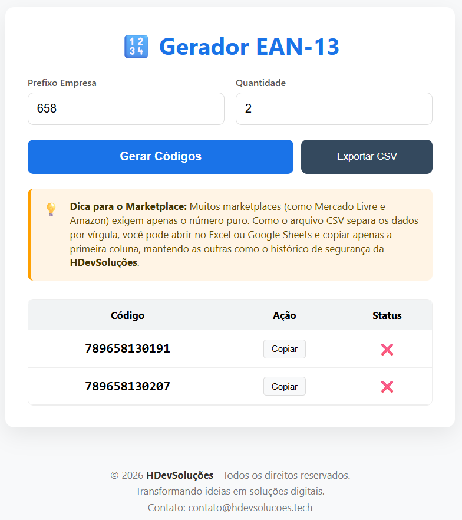

# 🔢 Gerador de EAN-13 para Marketplace




Uma solução web completa e leve para geração de códigos EAN-13 válidos, ideal para vendedores de marketplaces (Mercado Livre, Amazon, Shopee) que precisam gerenciar seus próprios códigos de barras de forma organizada.

## 🚀 Funcionalidades

- **Geração Inteligente:** Cria códigos EAN-13 válidos com cálculo automático de dígito verificador.
- **Flexibilidade de Prefixo:** Suporta prefixos personalizados de até 4 dígitos (com preenchimento automático de zeros).
- **Interface Moderna:** Design responsivo, limpo e intuitivo.
- **Exportação CSV:** Gere lotes de até 100 códigos e exporte para CSV com log de data/hora.
- **Cópia Rápida:** Botão de "Um clique" para copiar códigos individualmente.
- **Segurança Local:** Validação de integridade do código feita diretamente no backend.

## 🛠️ Tecnologias Utilizadas

- **Backend:** [FastAPI](https://tiangolo.com) (Python 3.12+)
- **Frontend:** HTML5, CSS3 moderno e Vanilla JavaScript (Fetch API)
- **Template Engine:** Jinja2
- **Servidor:** Uvicorn

## 📦 Como rodar o projeto localmente

1. **Clone o repositório:**

   ```bash
   git clone https://github.com/hdevsolucoes/gerador_ean_web_marketplace.git
   cd gerador_ean_web_marketplace
   ```

2. **Crie um ambiente virtual e ative-o:**

   ```bash
   python -m venv .venv
   # No Windows:
   .venv\Scripts\activate
   # No Linux/Mac:
   source .venv/bin/activate
   ```

3. **Instale as dependências:**

   ```bash
   pip install -r requirements.txt
   ```

4. **Inicie o servidor:**
   ```bash
   uvicorn main:app --reload
   ```
   Acesse em seu navegador: `http://localhost:8000`

## 🌐 Deploy em VPS Ubuntu (Gunicorn/Uvicorn + Nginx)

1. **Instale dependências:**

   ```bash
   sudo apt update && sudo apt install python3-venv python3-pip nginx
   python3 -m venv .venv
   source .venv/bin/activate
   pip install -r requirements.txt
   pip install gunicorn uvicorn
   ```

2. **Crie o serviço Gunicorn/Uvicorn:**
   Crie `/etc/systemd/system/gerador-ean.service` com:

   ```ini
   [Unit]
   Description=Gerador EAN-13 FastAPI
   After=network.target

   [Service]
   User=www-data
   WorkingDirectory=/caminho/para/seu/projeto
   ExecStart=/caminho/para/seu/projeto/.venv/bin/gunicorn main:app -k uvicorn.workers.UvicornWorker --bind 127.0.0.1:8001 --workers 2
   Restart=always

   [Install]
   WantedBy=multi-user.target
   ```

   Ative e inicie:

   ```bash
   sudo systemctl daemon-reload
   sudo systemctl enable gerador-ean
   sudo systemctl start gerador-ean
   ```

3. **Configure o Nginx:**
   Crie `/etc/nginx/sites-available/gerador-ean`:

   ```nginx
   server {
       listen 80;
       server_name seu-dominio.com;
       location / {
           proxy_pass http://127.0.0.1:8001;
           proxy_set_header Host $host;
           proxy_set_header X-Real-IP $remote_addr;
           proxy_set_header X-Forwarded-For $proxy_add_x_forwarded_for;
           proxy_set_header X-Forwarded-Proto $scheme;
       }
       location /static/ {
           alias /caminho/para/seu/projeto/static/;
       }
   }
   ```

   Ative e reinicie:

   ```bash
   sudo ln -s /etc/nginx/sites-available/gerador-ean /etc/nginx/sites-enabled/
   sudo nginx -t
   sudo systemctl restart nginx
   ```

4. **Acesse:**
   - http://seu-dominio.com

Pronto! Seu app FastAPI estará rodando em produção.

## 💡 Dica de Uso

Ao exportar seus códigos, o arquivo CSV incluirá a data e hora da geração. Isso serve como um histórico de segurança da **HDevSoluções**. Para cadastrar nos marketplaces, basta copiar apenas a primeira coluna do arquivo.

---

---

## Autor

**HDevSoluções**  
Transformando ideias em soluções digitais  
Desenvolvedor especializado em criar experiências digitais incríveis e funcionais

- **Contato:** contato@hdevsolucoes.tech / hdevsolucoes@gmail.com
- **WhatsApp:** (11) 96774-5351
- **Localização:** São Paulo - SP
- **Site:** https://hdevsolucoes.tech/

---

## Como contribuir ou utilizar

Você pode utilizar este projeto de duas formas:

- **Fork:**
  1.  Clique em "Fork" no topo da página do repositório no GitHub.
  2.  Faça suas alterações e envie Pull Requests para contribuir.

- **Clone:**
  1.  Clone o repositório para sua máquina:

  ```sh
  git clone https://github.com/hdevsolucoes/gerador_ean_web_marketplace.git
  ```

  2.  Siga as instruções de configuração e uso acima.

## 📄 Licença e direitos

Este projeto é distribuído sob a licença MIT. Você pode usar, modificar e distribuir livremente, desde que mantenha os créditos ao autor.

© 2026 HDevSoluções. Todos os direitos reservados.

Para mais detalhes, consulte o arquivo [LICENSE](LICENSE).

<div align="center">
   <a href="https://hdevsolucoes.tech/" title="Site"></a>
   <a href="https://github.com/hdevsolucoes" title="GitHub"></a>
   <a href="https://www.instagram.com/hdevsolucoes/" title="Instagram"></a>
   <a href="https://x.com/hdevsolucoes" title="X"></a>
   <a href="https://www.linkedin.com/in/harlem-afonso-claumann-silva-bb5160356/" title="LinkedIn"></a>
 </div>

<div align="center" style="margin-top: 2em;">
   <sub>© 2026 HDevSoluções. Todos os direitos reservados.</sub>
</div>
